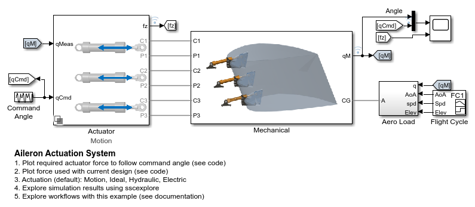
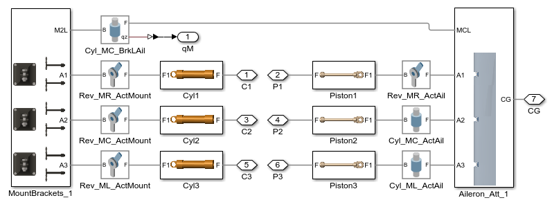
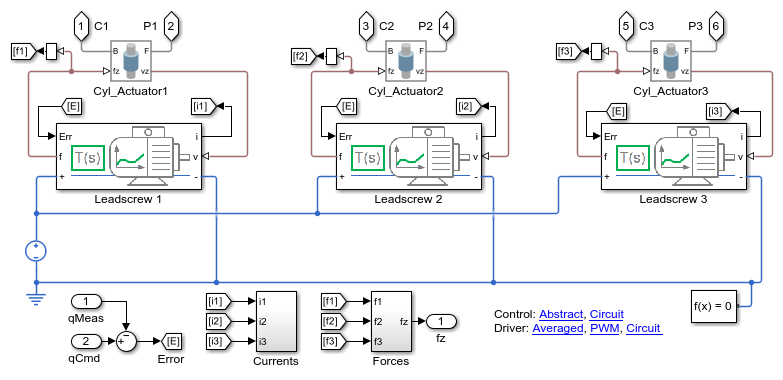

# **Aileron Actuation System**
Copyright 2013-2024 The MathWorks(TM), Inc.

View on  or 
[![Open in MATLAB Online]: (https://www.mathworks.com/images/responsive/global/open-in-matlab-online.svg)](https://matlab.mathworks.com/open/github/v1?repo=mathworks/Simscape-Aileron-Actuator&project=Aileron_Actuator.prj)

Models an aileron actuation system with multiple variants for the actuator. 
This model allows you to refine requirements for the actuation system
independent of actuation technology, and then to test various actuator
designs to see which one is best.  The level of fidelity of the model can
also be adjusted based on the test you wish to run.

You must open the project Aileron_Act.prj to set the path and load key values.

Scripts_Data/sm_aileron_actuator_Demo_Script.html will walk you
through most parts of the demo.

## **Model Overview**

